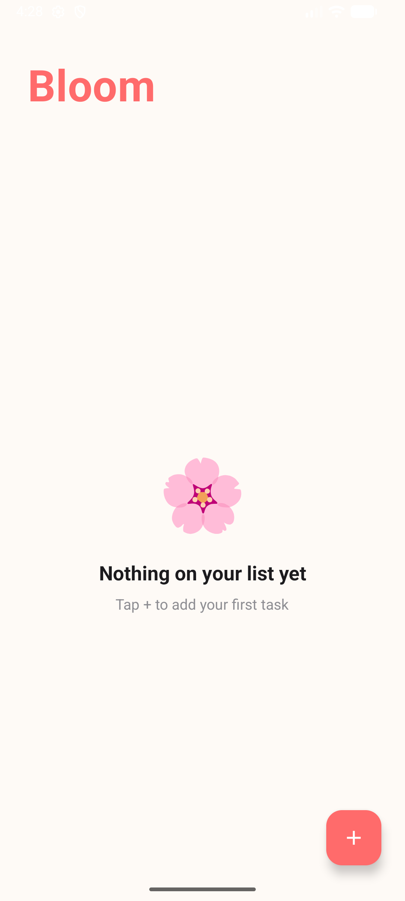

# Bloom 🌸

Bloom is a modern Android task management app built with **Kotlin**, **MVVM architecture**, and **Room database**. It's designed to be clean, fast, and intuitive — helping you stay on top of your day without the clutter.

## Screenshot



## Why This Project

Bloom shows Android fundamentals in a focused, useful app: persistent local data, task state updates, priority handling, RecyclerView interactions, and a clean single-purpose user experience. It is intentionally simple, but it demonstrates the kind of structure needed for maintainable mobile development.

---

## Features

- Add tasks via an elegant bottom sheet with a floating action button
- Assign priority levels — Low, Medium, or High — with color-coded indicators
- Tap to check off tasks with a satisfying strikethrough effect
- Swipe left or right to delete tasks, with an Undo option
- Tasks persist across app sessions using a local Room database
- Live task count that updates in real time
- Warm coral + cream UI with full dark mode support
- Empty state screen when your list is clear

## Skills Demonstrated

- Android development with Kotlin
- MVVM architecture
- Room database persistence
- RecyclerView and DiffUtil
- Coroutines
- Material Design UI
- Local data modeling

---

## Tech Stack

| Layer | Technology |
|---|---|
| Language | Kotlin |
| Architecture | MVVM (ViewModel + LiveData) |
| Database | Room (SQLite) |
| Dependency Injection | Manual (Repository pattern) |
| Async | Kotlin Coroutines |
| UI | XML Layouts + Material Design 3 |
| Build | Gradle Kotlin DSL + KSP |

---

## Architecture

```
app/
├── data/
│   ├── Task.kt              # Room entity + Priority enum
│   ├── TaskDao.kt           # Database access object
│   ├── TaskDatabase.kt      # Singleton Room database
│   └── TaskRepository.kt    # Data access abstraction
├── viewmodel/
│   └── TaskViewModel.kt     # UI state + business logic
├── TaskAdapter.kt           # RecyclerView with DiffUtil
└── MainActivity.kt          # Single-activity entry point
```

---

## Getting Started

1. Clone this repository
2. Open the project in Android Studio (Hedgehog or newer)
3. Let Gradle sync and download dependencies
4. Run on an emulator or device (API 24+)

No API keys or backend setup required — everything runs locally.

---

## Author

**Brianna Brockington**
Software Engineering Student
GitHub: https://github.com/briannab1997
